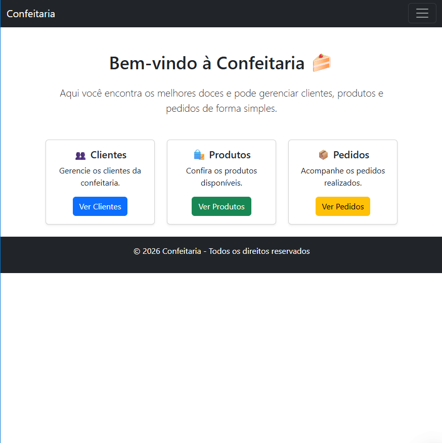
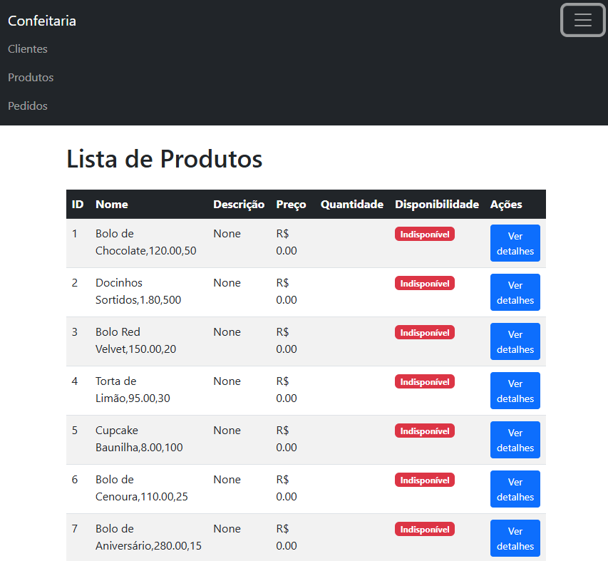
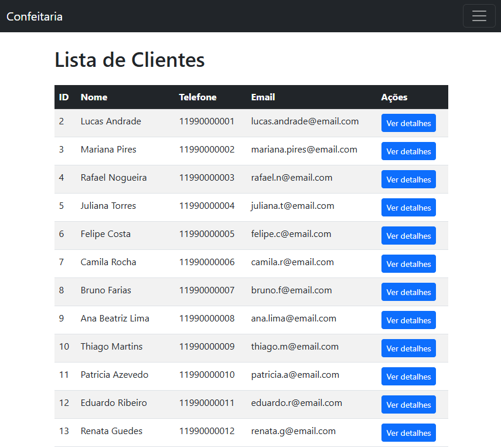
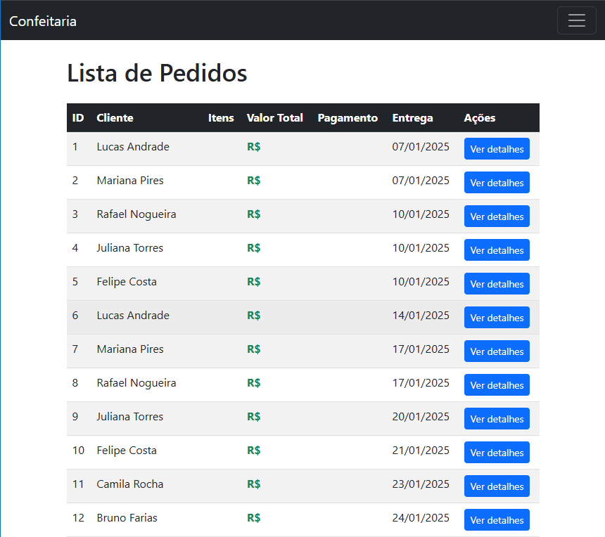

```markdown
# 🍰 Confeitaria Web

🐍 Python | 🌐 Django | 🎨 Bootstrap | 📊 Pandas | 💾 SQLite

Sistema web desenvolvido em **Django** para gestão de uma confeitaria.  
Permite o cadastro e gerenciamento de **clientes, endereços, produtos e pedidos**, com interface administrativa via Django Admin e páginas front-end estilizadas com Bootstrap.
---

## 🚀 Funcionalidades

- Cadastro e listagem de **clientes**  
- Cadastro e listagem de **endereços**  
- CRUD completo de **produtos** (criar, editar, excluir, listar, detalhar)  
- Consulta de **pedidos** com detalhes de cliente e itens  
- Interface administrativa para ajustes e correções  
- Templates organizados e responsivos com **Bootstrap 5**

---


## 📂 Estrutura do projeto

```
PROJETO-CONFEITARIA/
│
├── clientes/        # App de clientes
├── enderecos/       # App de endereços
├── pedidos/         # App de pedidos
├── produtos/        # App de produtos
├── templates/       # Templates globais (base.html, home.html, etc.)
├── db.sqlite3       # Banco de dados
├── manage.py        # Gerenciador Django
└── venv/            # Ambiente virtual
```

---

## ▶️ Como rodar o projeto

1. Clone o repositório:
   ```bash
   git clone https://github.com/gustavolima37/confeitaria-web.git
   cd confeitaria-web
   ```

2. Crie e ative o ambiente virtual:
   ```bash
   python -m venv venv
   source venv/bin/activate   # Linux/Mac
   venv\Scripts\activate      # Windows
   ```

3. Instale as dependências:
   ```bash
   pip install -r requirements.txt
   ```

4. Execute as migrações:
   ```bash
   python manage.py migrate
   ```

5. Crie um superusuário:
   ```bash
   python manage.py createsuperuser
   ```

6. Inicie o servidor:
   ```bash
   python manage.py runserver
   ```

7. Acesse:
   - Front-end: `http://localhost:8000/`  
   - Admin: `http://localhost:8000/admin/`

---

## 📸 Demonstração

### Tela Inicial


### Lista de Produtos


### Detalhe de Cliente


### Lista de Pedidos



---

## 👥 Autores

- Gustavo Lima — @gustavolima37 https://github.com/gustavolima37
- Flavia Regina — @flavireus https://github.com/flavireus
- Evelyne Kelly — @evelynekelly https://github.com/evelynekelly

## 📜 Licença

Este projeto está licenciado sob os termos da [MIT License](LICENSE).
---